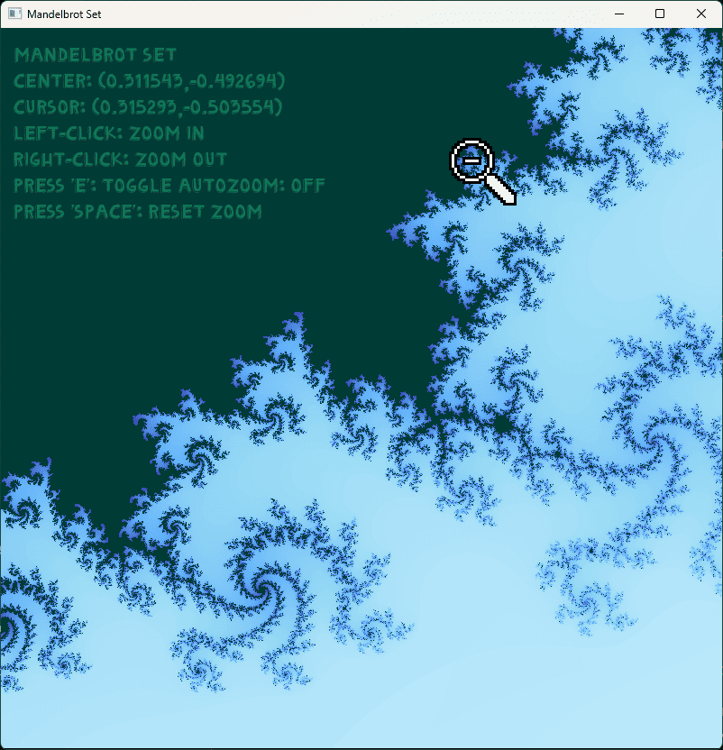

# Mandelbrot Set



# How to Run (Windows)

## 1. DOWNLOAD THE PROJECT
Follow one of these options to download and run **Mandelbrot.exe**:

### Option 1: Download ZIP
- Click the green **"Code"** button on the GitHub page.
- Select **"Download ZIP"**.
- Extract the ZIP file somewhere on your computer.

### Option 2: Clone with Git
- Open **Git Bash** or your terminal.
- Navigate to the folder where you want to download the project.
- Run the following command:

```bash
git clone https://github.com/pollyology/CISP400_MandelbrotSet
```


## 2. MOVE THE ASSETS FOLDER

- Inside the extracted folder, you'll see two folders:
  - `Mandelbrot`
  - `assets`
- Drag the entire **`assets`** folder **into** the `Mandelbrot` folder.  
  It should look like this:

  - `Mandelbrot\`
      - `Mandelbrot.exe`
      - `(SFML .dll files)`
      - `assets`
          - `(images, music, etc.)`


## 3. RUN THE EXECUTABLE

- Open the `Mandelbrot` folder.
- Double-click `Mandelbrot.exe` to launch the project.


## ⚠️ IMPORTANT

- The `assets` folder **must be inside** the `Mandelbrot` folder or the project will not work.


# HOW TO RUN/DEBUG IN VISUAL STUDIO

To build or debug **Mandelbrot** from source using Visual Studio:

1. **Additional Include Directories:**  
   `C:\SFML\include`

2. **Additional Library Directories:**  
   `C:\SFML\lib`

3. **Additional Dependencies:**  
   *(Paste this at the beginning of the list)*  
   `sfml-graphics-d.lib;sfml-window-d.lib;sfml-system-d.lib;sfml-audio-d.lib;`
